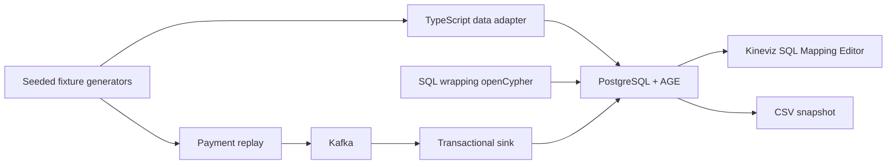

# Architecture and AGE compatibility

All three batch graphs share the `kineviz` database but occupy separate AGE
schemas. `_key` is the stable external identity used by the importer and exports;
AGE's internal graph IDs remain implementation details. Vertex keys include
their category to avoid collisions between different entity types. Transfer
edges carry independent keys, so parallel payments survive.

The loader creates labels through AGE, loads vertices in bounded `UNWIND`
batches, then matches endpoints and creates edges through Cypher. It writes no
AGE internal tables directly. It preserves numeric and boolean properties.
Each graph setup is one transaction, including its registry entry and reader
grants. Failure rolls back the complete graph. The registry records expected
counts; verification also runs the investigative queries and fixture assertions.

GIN property indexes support endpoint matching. Batch loading is deliberately
simple and intended for these demo sizes, not a production ingestion benchmark.
For much larger graphs, evaluate AGE's documented file loader and indexes against
your version and data types. The CLI serializes setup: don't run separate `up`
commands concurrently because graph/catalog operations can hold locks.

The Kafka replay uses `paysim_stream`, one partition, and one sink. Actors and
identity edges are seeded before transactions arrive. A PostgreSQL receipt key
deduplicates each generated event, committed atomically with its AGE mutation.
The sink commits before the Kafka handler completes. Redelivery after a crash is
therefore harmless for the same immutable event ID. This is at-least-once
delivery with idempotent application, not a claim of Kafka-wide exactly-once
processing. Event IDs must not be reused for changed payloads; this demo is an
immutable replay, not an update/CDC protocol.

## Tested release behavior

The image is `apache/age:release_PG16_1.6.0`, pinned by its multi-architecture
manifest digest in Compose. Consult [VALIDATION.md](VALIDATION.md) for the
observed server and extension versions.

- Use a dollar-quoted constant for the Cypher query. The implementation chooses
  a delimiter absent from the payload.
- The SQL result definition must contain one `agtype` column per Cypher return
  expression, even for write queries with no returned rows.
- Use `WITH ... AS alias` before ordering on aggregate aliases.
- Assign a map variable in `SET e = props`; the loader binds nested row
  properties through `WITH` before assignment.
- Cast scalar `agtype` results explicitly to PostgreSQL types. A uniform JSON
  conversion fails for some scalar types in this release.
- Use `*1..4` for bounded variable-length Cypher traversal.
- Filter `type(edge) IN [...]` when matching several relationship labels; the
  pinned release does not accept `[:TYPE_A|TYPE_B]` alternation syntax.
- AGE properties are flexible maps. Labels have backing tables and are not
  Spanner dynamic labels; SQL/PGQ and Spanner GQL are different query languages.

Official references: [AGE source](https://github.com/apache/age),
[query format](https://age.apache.org/age-manual/master/intro/cypher.html), and
[setup](https://age.apache.org/age-manual/master/intro/setup.html).
